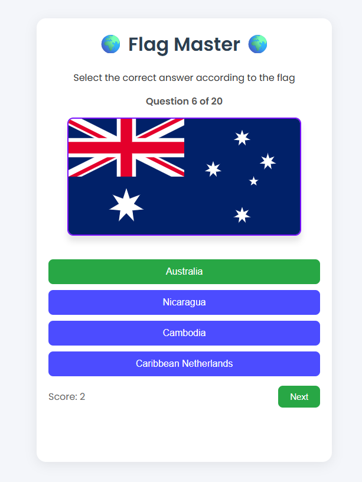

# Flag Master

 


A small, polished flag quiz built with HTML/CSS/vanilla JS using the REST Countries API.

**Live demo:** (add after you enable GitHub Pages)

## Features
- **Randomized questions** (default: 20 per round)
- **REST Countries API** for up-to-date flags (SVG preferred, PNG fallback)
- **Instant feedback** on answers (buttons turn green/red)
- **Smooth “Next” button** (no layout shift; space is reserved)
- **Score tracking** displayed during the round
- **Clear end screen** with final score and restart option
- **Basic error handling** if the API request fails

## Tech
- HTML, CSS, JavaScript (Fetch API)

## Getting Started
Open `index.html` directly in a browser, or run a tiny local server:

```bash
# from the project folder
python -m http.server 8080
# then visit http://localhost:8080
